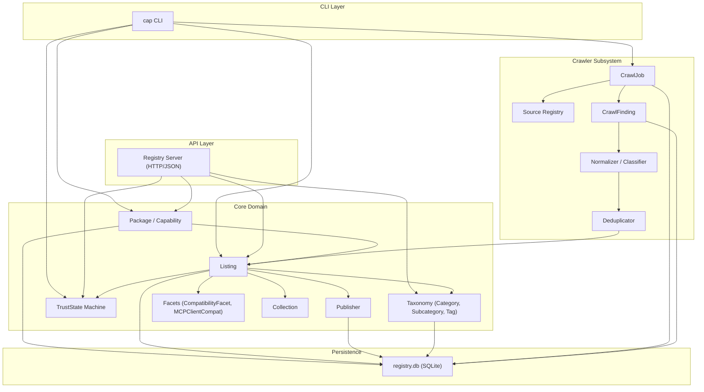
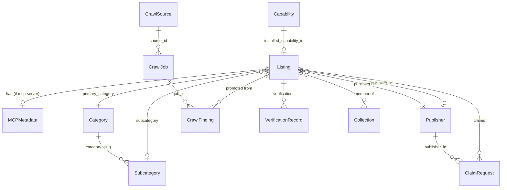
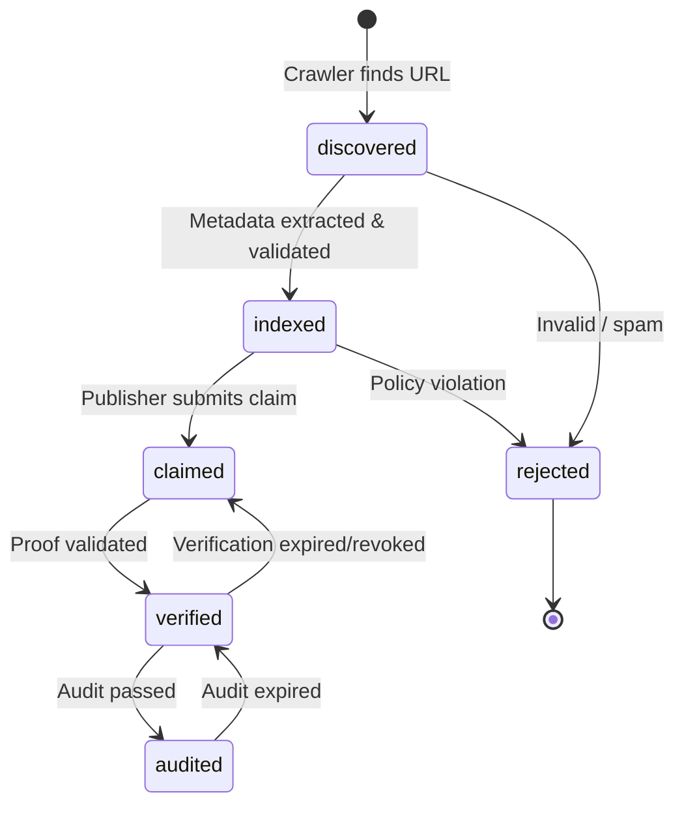
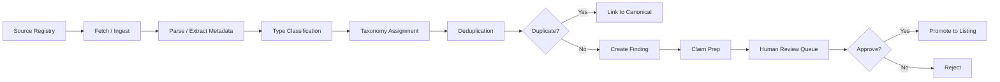

# Capacium Core V2 — Product Requirements Document

**Version:** 2.0.0-draft  
**Date:** 2026-04-24  
**Status:** Draft  
**Repository:** github.com/Capacium/capacium  
**Baseline:** Capacium v0.4.1 (current `main`)

---

## 1. Executive Summary

Capacium Core V2 extends the existing Capability Packaging System from a skill-centric install/verify tool into an **open Capability Registry and Discovery Core**. Three tightly coupled extensions form a single architectural program:

1. **MCP-Server Extension** — introduces `mcp-server` as a first-class package type with dedicated metadata, client-compatibility facets, and health-signal readiness.
2. **Exchange Core** — adds Listing, Taxonomy, Trust State, Publisher, and Search as registry-native data structures, making Discovery and Discoverability a core function rather than a UI afterthought.
3. **Crawler Core** — provides systematic discovery, ingestion, normalization, deduplication, and claim/verify preparation as an integral system function.

These three extensions share a unified domain model, a single SQLite-based persistence layer (extending the existing `registry.db`), and a common CLI/API surface.

### Key Differentiators

- **Capability-native, skill-facing**: The core models capabilities generically; externally the system remains approachable via the established skill/bundle vocabulary.
- **Core first**: All structures are data models, state machines, and registry logic — not UI features.
- **Trust as state machine**: Trust levels (`discovered` → `indexed` → `claimed` → `verified` → `audited`) are explicit, first-class state transitions with entry criteria and audit trails.
- **Zero new external dependencies** for the core path (stdlib-only; optional extras for YAML, signing).

---

## 2. Problem Statement

### Current Limitations (v0.4.1)

| Area | Limitation |
|------|-----------|
| **Type system** | `Kind` enum has 6 values (`skill`, `bundle`, `tool`, `prompt`, `template`, `workflow`) but no `mcp-server`. MCP servers cannot be accurately typed. |
| **Discovery** | Search is limited to `owner LIKE ? OR name LIKE ?` on local `capabilities` table. No taxonomy, tags, facets, or trust filtering. |
| **Trust** | Trust is implicit — a package is either installed or not. No lifecycle from discovery through verification. |
| **Indexing** | The registry only knows about locally installed capabilities. There is no concept of a "listing" that exists in the index but is not installed. |
| **Publishing** | `cap publish` is a stub. No claim, verify, or publisher identity model. |
| **Crawling** | Non-existent. Discovery of external capabilities is entirely manual. |
| **Metadata** | `Capability` dataclass has 8 fields. MCP-specific metadata (clients, transport, health) has no home. |
| **API** | `registry_server.py` serves the existing `capabilities` table as JSON but has no listing, taxonomy, or trust endpoints. |

### Opportunity

The AI agent ecosystem is fragmenting across skill directories (askill, skills.sh), MCP server listings (MCP Market, Smithery), and framework-specific tool registries. Capacium is positioned to provide a **neutral, open, capability-native registry core** that unifies discovery, packaging, trust, and indexing across types and frameworks.

---

## 3. Target Users & Personas

| Persona | Description | Primary Needs |
|---------|-------------|---------------|
| **Capability Developer** | Publishes skills, MCP servers, or bundles | Claim ownership, get verified, be discoverable |
| **Agent Operator** | Installs and manages capabilities for AI agents | Search by type/category/trust, install, verify integrity |
| **Platform Integrator** | Builds frontends, CMS bridges, or marketplace UIs on top of Capacium | Consume Exchange API, faceted search, trust data |
| **Crawler Operator / Admin** | Runs discovery crawls, reviews findings, promotes trust states | CLI-based crawl management, duplicate review, trust promotion |

---

## 4. Solution Overview

### Architecture Diagram



---

## 5. Scope & Constraints

### In Scope (V2 Core)

- Extension of `Kind` enum with `MCP_SERVER` (and later extensibility)
- `Listing` entity with full metadata, separate from the installed `Capability`
- `Publisher` entity with claim/verify lifecycle
- `TrustState` as explicit state machine with 5 levels
- Core Taxonomy: 10 top-level categories, subcategories, freeform tags
- Faceted search: type, category, trust, publisher, MCP client compatibility
- Crawler subsystem: sources, jobs, findings, normalization, dedup
- CLI commands: `cap info`, `cap claim`, `cap crawl`, `cap exchange search`, type/category/trust filters on `cap search`
- API endpoints: listings, taxonomy, search, trust, crawl results
- SQLite schema migrations for all new tables
- Full test coverage for new modules

### Out of Scope

- WordPress / Voxel / CMS integration
- Web frontend implementation (HTML/CSS/JS marketplace UI)
- Payment, token, escrow, bidding, mission logic
- Advertorial / sponsoring logic
- Board / job marketplace economy
- SEO / landing page / content marketing
- `cap connect` and `cap health` execution (schema-only preparation)

---

## 6. Core Domain Model

### 6.1 Entity Definitions

#### 6.1.1 Kind (Extended Enum)

```python
class Kind(Enum):
    SKILL = "skill"
    BUNDLE = "bundle"
    TOOL = "tool"
    PROMPT = "prompt"
    TEMPLATE = "template"
    WORKFLOW = "workflow"
    MCP_SERVER = "mcp-server"       # NEW
    CONNECTOR_PACK = "connector-pack"  # Reserved for future
```

**Design decision:** `mcp-server` uses a hyphen (not underscore) to match MCP ecosystem naming conventions. The `Kind` enum maps the Python name `MCP_SERVER` to the string value `"mcp-server"`.

#### 6.1.2 TrustState

```python
class TrustState(Enum):
    DISCOVERED = "discovered"
    INDEXED = "indexed"
    CLAIMED = "claimed"
    VERIFIED = "verified"
    AUDITED = "audited"
```

| State | Entry Criteria | Required Fields | Who Triggers |
|-------|---------------|-----------------|-------------|
| `discovered` | Crawler finds a URL/repo that looks like a capability | `canonical_url`, `package_type` (inferred) | Crawler |
| `indexed` | Minimum metadata extracted and validated | All mandatory listing fields populated | Crawler / Admin |
| `claimed` | Publisher asserts ownership | `publisher_id`, `claim_proof` (repo token file or domain TXT) | Publisher via CLI/API |
| `verified` | Claim proof validated | `verification_record` with method + timestamp | System (automated proof check) or Admin |
| `audited` | Manual or automated security/quality audit passed | `audit_record` with auditor, scope, result | Admin / Trusted Auditor |

State transitions are strictly forward except for demotion paths (e.g., `verified` → `claimed` if verification expires or is revoked).

#### 6.1.3 Listing

The `Listing` is the central entity in the Exchange Core. It represents a capability artifact that is **known to the registry** — whether or not it is installed locally.

```python
@dataclass
class Listing:
    # Identity
    id: str                          # UUID v4
    canonical_name: str              # e.g. "anthropic/mcp-filesystem"
    package_type: Kind               # e.g. Kind.MCP_SERVER
    
    # Source
    canonical_source_url: str        # e.g. "https://github.com/anthropic/mcp-filesystem"
    source_urls: List[str]           # all known source URLs (aliases, forks)
    
    # Metadata
    short_description: str           # max 280 chars
    long_description: str            # markdown, optional
    
    # Trust
    trust_state: TrustState          # current trust level
    trust_history: List[TrustTransition]  # audit trail
    
    # Taxonomy
    primary_category: str            # slug from Category table
    subcategory: Optional[str]       # slug from Subcategory table
    tags: List[str]                  # freeform tags
    
    # Publisher
    publisher_id: Optional[str]      # FK to Publisher
    
    # Compatibility
    target_frameworks: List[str]     # ["opencode", "claude-code", ...]
    
    # Installability
    installability: str              # "local-install", "remote-connect", "manual-setup"
    install_reference: Optional[str] # cap install spec or setup URL
    
    # License
    license: Optional[str]           # SPDX identifier
    
    # Maturity
    maturity: str                    # "experimental", "beta", "stable", "deprecated"
    
    # Timestamps
    discovered_at: datetime
    indexed_at: Optional[datetime]
    updated_at: datetime
    
    # MCP-specific (nullable for non-MCP types)
    mcp_metadata: Optional[MCPMetadata]
    
    # Link to local installation (if installed)
    installed_capability_id: Optional[int]  # FK to capabilities table
```

#### 6.1.4 MCPMetadata

```python
@dataclass
class MCPMetadata:
    # Client compatibility
    supported_clients: List[str]     # ["claude-desktop", "claude-code", "cursor", "opencode", "codex"]
    
    # Transport
    transport: str                   # "stdio", "sse", "streamable-http"
    
    # Runtime
    runtime: Optional[str]           # "node", "python", "docker", "binary"
    hosted: bool                     # true = cloud-hosted, false = local
    
    # Auth
    auth_model: Optional[str]        # "none", "api-key", "oauth2", "token"
    required_env_vars: List[str]     # ["GITHUB_TOKEN", "API_KEY"]
    permission_scopes: List[str]     # ["read:repo", "write:file"]
    
    # Health (schema-only for V2, no active checks)
    health_endpoint: Optional[str]   # URL for future health probing
    health_status: Optional[str]     # "unknown", "up", "degraded", "down"
    last_health_check: Optional[datetime]
    
    # Setup
    setup_command: Optional[str]     # e.g. "npx -y @anthropic/mcp-filesystem"
    documentation_url: Optional[str]
    command_examples: List[str]      # example MCP config snippets
```

#### 6.1.5 Publisher

```python
@dataclass
class Publisher:
    id: str                          # UUID
    display_name: str                # e.g. "Anthropic"
    slug: str                        # e.g. "anthropic"
    
    # Identity proofs
    primary_proof_type: str          # "github-repo", "domain-dns", "account"
    primary_proof_value: str         # e.g. "github.com/anthropic"
    
    # Status
    verified: bool
    verified_at: Optional[datetime]
    verification_method: Optional[str]
    
    # Contact
    contact_url: Optional[str]       # homepage, GitHub profile
    
    # Timestamps
    created_at: datetime
    updated_at: datetime
```

#### 6.1.6 Category / Subcategory / Tag

```python
@dataclass
class Category:
    slug: str                        # PK, e.g. "developer-tools"
    display_name: str                # e.g. "Developer Tools"
    description: str
    sort_order: int

@dataclass
class Subcategory:
    slug: str                        # PK, e.g. "code-review"
    category_slug: str               # FK to Category
    display_name: str
    sort_order: int

# Tags are stored inline on Listing as List[str]
# A separate tags table tracks tag usage counts for discovery
@dataclass
class TagCount:
    tag: str                         # PK
    count: int                       # number of listings using this tag
```

#### 6.1.7 MCP Client Compatibility (Facet)

```python
class MCPClient(Enum):
    CLAUDE_DESKTOP = "claude-desktop"
    CLAUDE_CODE = "claude-code"
    CURSOR = "cursor"
    OPENCODE = "opencode"
    CODEX = "codex"
    CONTINUE = "continue"
    WINDSURF = "windsurf"
    GENERIC = "generic-mcp-client"
```

Stored as a list on `MCPMetadata.supported_clients`, queryable as a facet.

#### 6.1.8 Collection

```python
@dataclass
class Collection:
    id: str                          # UUID
    slug: str                        # URL-friendly name
    display_name: str
    description: str
    listing_ids: List[str]           # ordered list of Listing IDs
    curated_by: Optional[str]        # publisher or admin identifier
    created_at: datetime
    updated_at: datetime
```

#### 6.1.9 Crawler Entities

```python
@dataclass
class CrawlSource:
    id: str                          # UUID
    name: str                        # e.g. "github-mcp-servers"
    source_type: str                 # "github-search", "directory-page", "registry-api", "manifest-scan"
    url: str                         # entry point URL
    config: Dict[str, Any]           # source-specific config (search terms, API params)
    enabled: bool
    last_crawled_at: Optional[datetime]
    created_at: datetime

@dataclass
class CrawlJob:
    id: str                          # UUID
    source_id: str                   # FK to CrawlSource
    status: str                      # "pending", "running", "completed", "failed"
    started_at: Optional[datetime]
    completed_at: Optional[datetime]
    findings_count: int
    new_listings_count: int
    duplicates_skipped: int
    errors: List[str]

@dataclass
class CrawlFinding:
    id: str                          # UUID
    job_id: str                      # FK to CrawlJob
    source_url: str                  # where it was found
    
    # Extracted metadata
    inferred_name: str
    inferred_type: Optional[str]     # "skill", "mcp-server", etc.
    inferred_description: Optional[str]
    inferred_category: Optional[str]
    inferred_tags: List[str]
    
    # Processing status
    status: str                      # "raw", "normalized", "duplicate", "promoted", "rejected"
    promoted_listing_id: Optional[str]  # FK to Listing if promoted
    
    # Dedup
    canonical_match_id: Optional[str]   # FK to existing Listing if duplicate detected
    similarity_score: Optional[float]   # 0.0 - 1.0
    
    # Claim prep
    detected_owner: Optional[str]       # inferred repo owner or domain owner
    contact_hints: List[str]            # URLs, emails for claim outreach
    
    created_at: datetime

@dataclass
class ClaimRequest:
    id: str                          # UUID
    listing_id: str                  # FK to Listing
    publisher_id: str                # FK to Publisher
    proof_type: str                  # "repo-file", "domain-dns", "manual"
    proof_value: str                 # content of proof
    status: str                      # "pending", "approved", "rejected", "expired"
    submitted_at: datetime
    reviewed_at: Optional[datetime]
    reviewed_by: Optional[str]       # admin identifier

@dataclass
class VerificationRecord:
    id: str                          # UUID
    listing_id: str                  # FK to Listing
    method: str                      # "repo-token-file", "dns-txt", "manual-admin"
    result: str                      # "pass", "fail"
    details: str                     # human-readable description
    verified_at: datetime
    expires_at: Optional[datetime]   # verification may expire
    verifier: str                    # system or admin identifier
```

### 6.2 Entity Relationships



---

## 7. Core Taxonomy V1

### 7.1 Top-Level Categories

| Slug | Display Name | Description |
|------|-------------|-------------|
| `productivity` | Productivity | Task management, note-taking, time tracking, calendar |
| `developer-tools` | Developer Tools | Code review, debugging, testing, CI/CD, IDE extensions |
| `data-knowledge` | Data & Knowledge | Search, RAG, embeddings, knowledge bases, data processing |
| `automation-workflows` | Automation & Workflows | Orchestration, scheduling, pipeline automation |
| `integrations-connectors` | Integrations & Connectors | API bridges, service connectors, protocol adapters |
| `ai-agents` | AI & Agents | Agent frameworks, model wrappers, prompt engineering |
| `mcp-servers` | MCP Servers | Model Context Protocol server implementations |
| `templates-assets` | Templates & Assets | Project scaffolds, code templates, boilerplate generators |
| `security-governance` | Security & Governance | Auth, compliance, audit, vulnerability scanning |
| `operations-monitoring` | Operations & Monitoring | Logging, metrics, alerting, infrastructure management |

### 7.2 Example Subcategories

| Parent | Subcategory Slug | Display Name |
|--------|-----------------|-------------|
| `developer-tools` | `code-review` | Code Review |
| `developer-tools` | `testing` | Testing & QA |
| `developer-tools` | `debugging` | Debugging |
| `data-knowledge` | `search-retrieval` | Search & Retrieval |
| `data-knowledge` | `embeddings` | Embeddings & Vectors |
| `mcp-servers` | `filesystem` | Filesystem Access |
| `mcp-servers` | `database` | Database Access |
| `mcp-servers` | `web-api` | Web & API Access |
| `ai-agents` | `orchestration` | Agent Orchestration |
| `integrations-connectors` | `cloud-services` | Cloud Services |

Subcategories are additive — new ones can be added without schema migration (stored in a table row, not an enum).

---

## 8. Faceted Search Model

### 8.1 Facet Definitions

| Facet | Type | Values | Applicable To |
|-------|------|--------|--------------|
| `package_type` | enum | All `Kind` values | All listings |
| `category` | FK slug | Category table | All listings |
| `subcategory` | FK slug | Subcategory table | All listings |
| `tags` | list[str] | Freeform | All listings |
| `trust_state` | enum | `TrustState` values | All listings |
| `publisher_status` | enum | `unowned`, `claimed`, `verified` | All listings |
| `installability` | enum | `local-install`, `remote-connect`, `manual-setup` | All listings |
| `license` | string (SPDX) | `MIT`, `Apache-2.0`, etc. | All listings |
| `maturity` | enum | `experimental`, `beta`, `stable`, `deprecated` | All listings |
| `framework` | list[str] | `opencode`, `claude-code`, etc. | All listings |
| `mcp_client` | list[str] | `MCPClient` values | MCP listings only |
| `mcp_transport` | enum | `stdio`, `sse`, `streamable-http` | MCP listings only |
| `mcp_hosted` | bool | true/false | MCP listings only |

### 8.2 Search Query Model

```python
@dataclass
class SearchQuery:
    text: Optional[str] = None          # full-text search
    package_type: Optional[Kind] = None
    category: Optional[str] = None
    subcategory: Optional[str] = None
    tags: Optional[List[str]] = None    # AND semantics
    trust_state: Optional[TrustState] = None
    min_trust_state: Optional[TrustState] = None  # "at least indexed"
    publisher_id: Optional[str] = None
    installability: Optional[str] = None
    license: Optional[str] = None
    maturity: Optional[str] = None
    mcp_client: Optional[str] = None    # filter MCP listings by client
    mcp_transport: Optional[str] = None
    mcp_hosted: Optional[bool] = None
    limit: int = 50
    offset: int = 0
    sort_by: str = "relevance"          # "relevance", "name", "trust", "updated"
```

---

## 9. Trust State Machine

### 9.1 State Transition Diagram



### 9.2 Trust Entry Criteria Detail

| Transition | Required Action | Validation |
|-----------|-----------------|------------|
| `→ discovered` | Crawler submits finding | URL resolves, looks like a capability |
| `discovered → indexed` | Metadata normalized | All mandatory listing fields filled: name, type, source URL, description, category |
| `indexed → claimed` | Publisher files `ClaimRequest` with proof | Proof type matches (repo-file, DNS TXT, manual), publisher identity created |
| `claimed → verified` | System validates proof | For `repo-file`: file `/.capacium-verify` exists in repo with expected token. For `dns-txt`: TXT record `capacium-verify=<token>` found on domain. |
| `verified → audited` | Admin/auditor submits `AuditRecord` | Audit scope defined, result = pass, auditor identity recorded |

### 9.3 Claim Proof Types

| Type | Mechanism | Strength | Speed |
|------|-----------|----------|-------|
| `repo-file` | Place `/.capacium-verify` with token in repository root | Medium | Fast (minutes) |
| `domain-dns` | Add TXT record `capacium-verify=<token>` to domain | High | Slow (DNS propagation) |
| `manual-admin` | Admin reviews evidence and approves manually | Varies | Slow (human review) |

---

## 10. SQLite Schema (New Tables)

All new tables extend the existing `registry.db`. Existing tables (`capabilities`, `bundle_members`, `signatures`) remain unchanged.

```sql
-- Listings table
CREATE TABLE IF NOT EXISTS listings (
    id TEXT PRIMARY KEY,
    canonical_name TEXT NOT NULL UNIQUE,
    package_type TEXT NOT NULL DEFAULT 'skill',
    canonical_source_url TEXT NOT NULL,
    source_urls TEXT,                    -- JSON array
    short_description TEXT NOT NULL DEFAULT '',
    long_description TEXT DEFAULT '',
    trust_state TEXT NOT NULL DEFAULT 'discovered',
    trust_history TEXT,                  -- JSON array of transitions
    primary_category TEXT NOT NULL DEFAULT 'developer-tools',
    subcategory TEXT,
    tags TEXT,                           -- JSON array
    publisher_id TEXT,
    target_frameworks TEXT,              -- JSON array
    installability TEXT DEFAULT 'local-install',
    install_reference TEXT,
    license TEXT,
    maturity TEXT DEFAULT 'experimental',
    discovered_at TEXT NOT NULL,
    indexed_at TEXT,
    updated_at TEXT NOT NULL,
    installed_capability_id INTEGER,
    mcp_metadata TEXT,                   -- JSON blob for MCPMetadata
    FOREIGN KEY (publisher_id) REFERENCES publishers(id),
    FOREIGN KEY (primary_category) REFERENCES categories(slug),
    FOREIGN KEY (installed_capability_id) REFERENCES capabilities(id)
);

CREATE INDEX IF NOT EXISTS idx_listings_type ON listings (package_type);
CREATE INDEX IF NOT EXISTS idx_listings_trust ON listings (trust_state);
CREATE INDEX IF NOT EXISTS idx_listings_category ON listings (primary_category);
CREATE INDEX IF NOT EXISTS idx_listings_publisher ON listings (publisher_id);
CREATE INDEX IF NOT EXISTS idx_listings_canonical ON listings (canonical_name);

-- Publishers table
CREATE TABLE IF NOT EXISTS publishers (
    id TEXT PRIMARY KEY,
    display_name TEXT NOT NULL,
    slug TEXT NOT NULL UNIQUE,
    primary_proof_type TEXT NOT NULL DEFAULT 'account',
    primary_proof_value TEXT NOT NULL DEFAULT '',
    verified INTEGER NOT NULL DEFAULT 0,
    verified_at TEXT,
    verification_method TEXT,
    contact_url TEXT,
    created_at TEXT NOT NULL,
    updated_at TEXT NOT NULL
);

CREATE INDEX IF NOT EXISTS idx_publishers_slug ON publishers (slug);

-- Categories table
CREATE TABLE IF NOT EXISTS categories (
    slug TEXT PRIMARY KEY,
    display_name TEXT NOT NULL,
    description TEXT DEFAULT '',
    sort_order INTEGER DEFAULT 0
);

-- Subcategories table
CREATE TABLE IF NOT EXISTS subcategories (
    slug TEXT PRIMARY KEY,
    category_slug TEXT NOT NULL,
    display_name TEXT NOT NULL,
    sort_order INTEGER DEFAULT 0,
    FOREIGN KEY (category_slug) REFERENCES categories(slug)
);

-- Tag counts table
CREATE TABLE IF NOT EXISTS tag_counts (
    tag TEXT PRIMARY KEY,
    count INTEGER NOT NULL DEFAULT 0
);

-- Collections table
CREATE TABLE IF NOT EXISTS collections (
    id TEXT PRIMARY KEY,
    slug TEXT NOT NULL UNIQUE,
    display_name TEXT NOT NULL,
    description TEXT DEFAULT '',
    listing_ids TEXT,                    -- JSON array
    curated_by TEXT,
    created_at TEXT NOT NULL,
    updated_at TEXT NOT NULL
);

-- Crawl sources table
CREATE TABLE IF NOT EXISTS crawl_sources (
    id TEXT PRIMARY KEY,
    name TEXT NOT NULL UNIQUE,
    source_type TEXT NOT NULL,
    url TEXT NOT NULL,
    config TEXT,                         -- JSON blob
    enabled INTEGER NOT NULL DEFAULT 1,
    last_crawled_at TEXT,
    created_at TEXT NOT NULL
);

-- Crawl jobs table
CREATE TABLE IF NOT EXISTS crawl_jobs (
    id TEXT PRIMARY KEY,
    source_id TEXT NOT NULL,
    status TEXT NOT NULL DEFAULT 'pending',
    started_at TEXT,
    completed_at TEXT,
    findings_count INTEGER DEFAULT 0,
    new_listings_count INTEGER DEFAULT 0,
    duplicates_skipped INTEGER DEFAULT 0,
    errors TEXT,                         -- JSON array
    FOREIGN KEY (source_id) REFERENCES crawl_sources(id)
);

CREATE INDEX IF NOT EXISTS idx_jobs_source ON crawl_jobs (source_id);
CREATE INDEX IF NOT EXISTS idx_jobs_status ON crawl_jobs (status);

-- Crawl findings table
CREATE TABLE IF NOT EXISTS crawl_findings (
    id TEXT PRIMARY KEY,
    job_id TEXT NOT NULL,
    source_url TEXT NOT NULL,
    inferred_name TEXT NOT NULL,
    inferred_type TEXT,
    inferred_description TEXT,
    inferred_category TEXT,
    inferred_tags TEXT,                  -- JSON array
    status TEXT NOT NULL DEFAULT 'raw',
    promoted_listing_id TEXT,
    canonical_match_id TEXT,
    similarity_score REAL,
    detected_owner TEXT,
    contact_hints TEXT,                  -- JSON array
    created_at TEXT NOT NULL,
    FOREIGN KEY (job_id) REFERENCES crawl_jobs(id),
    FOREIGN KEY (promoted_listing_id) REFERENCES listings(id)
);

CREATE INDEX IF NOT EXISTS idx_findings_job ON crawl_findings (job_id);
CREATE INDEX IF NOT EXISTS idx_findings_status ON crawl_findings (status);

-- Claim requests table
CREATE TABLE IF NOT EXISTS claim_requests (
    id TEXT PRIMARY KEY,
    listing_id TEXT NOT NULL,
    publisher_id TEXT NOT NULL,
    proof_type TEXT NOT NULL,
    proof_value TEXT NOT NULL,
    status TEXT NOT NULL DEFAULT 'pending',
    submitted_at TEXT NOT NULL,
    reviewed_at TEXT,
    reviewed_by TEXT,
    FOREIGN KEY (listing_id) REFERENCES listings(id),
    FOREIGN KEY (publisher_id) REFERENCES publishers(id)
);

-- Verification records table
CREATE TABLE IF NOT EXISTS verification_records (
    id TEXT PRIMARY KEY,
    listing_id TEXT NOT NULL,
    method TEXT NOT NULL,
    result TEXT NOT NULL,
    details TEXT DEFAULT '',
    verified_at TEXT NOT NULL,
    expires_at TEXT,
    verifier TEXT NOT NULL,
    FOREIGN KEY (listing_id) REFERENCES listings(id)
);
```

---

## 11. CLI Extensions

### 11.1 Updated / New Commands

| Command | Status | Description |
|---------|--------|-------------|
| `cap search` | **Extended** | Add `--type`, `--category`, `--trust`, `--tag`, `--mcp-client` filters |
| `cap info <name>` | **New** | Show full listing details including trust, MCP metadata, publisher |
| `cap claim <name>` | **New** | Submit a claim request for a listing |
| `cap exchange search` | **New** | Dedicated exchange search with all facets |
| `cap exchange categories` | **New** | List all categories and subcategories |
| `cap exchange tags` | **New** | List popular tags |
| `cap crawl run [source]` | **New** | Trigger a crawl job |
| `cap crawl sources` | **New** | List/manage crawl sources |
| `cap crawl findings [job]` | **New** | Review crawl findings |
| `cap crawl promote <finding>` | **New** | Promote a finding to listing |
| `cap trust promote <name> <state>` | **New** | Admin: advance trust state |
| `cap trust history <name>` | **New** | Show trust state transitions |
| `cap connect <name>` | **Reserved** | Future: configure MCP connection |
| `cap health <name>` | **Reserved** | Future: check MCP server health |

### 11.2 Updated `cap search` Flags

```
cap search <query>
    --type <kind>              Filter by package type (skill, mcp-server, bundle, ...)
    --category <slug>          Filter by category
    --trust <state>            Filter by exact trust state
    --min-trust <state>        Filter by minimum trust level
    --tag <tag>                Filter by tag (repeatable)
    --mcp-client <client>      Filter MCP servers by client compatibility
    --publisher <slug>         Filter by publisher
    --installed                Show only locally installed
    --registry <url>           Search remote registry
    --limit <n>                Max results (default: 50)
    --offset <n>               Pagination offset
    --sort <field>             Sort by: relevance, name, trust, updated
    --json                     Output as JSON
```

### 11.3 `cap info` Output Example

```
$ cap info anthropic/mcp-filesystem

  Name:        anthropic/mcp-filesystem
  Type:        mcp-server
  Trust:       verified ✓
  Publisher:   Anthropic (verified)
  Category:    MCP Servers > Filesystem Access
  Tags:        filesystem, file-access, local, node
  License:     MIT
  Maturity:    stable

  MCP Details:
    Transport:  stdio
    Runtime:    node
    Hosted:     no (local)
    Clients:    claude-desktop, cursor, opencode
    Auth:       none
    Setup:      npx -y @anthropic/mcp-filesystem <path>

  Source:      https://github.com/anthropic/mcp-filesystem
  Installed:   no
  Install:     cap install anthropic/mcp-filesystem
```

---

## 12. API Extensions

### 12.1 New Endpoints

All endpoints under `/v1/`:

| Method | Path | Description |
|--------|------|-------------|
| GET | `/listings` | Search/list listings with faceted filters |
| GET | `/listings/{id}` | Get listing details |
| POST | `/listings` | Create listing (admin/crawler) |
| PATCH | `/listings/{id}` | Update listing metadata |
| GET | `/categories` | List all categories |
| GET | `/categories/{slug}` | Get category with subcategories |
| GET | `/tags` | List tags with usage counts |
| GET | `/publishers` | List publishers |
| GET | `/publishers/{slug}` | Get publisher details |
| POST | `/claims` | Submit claim request |
| GET | `/claims/{id}` | Get claim status |
| POST | `/claims/{id}/verify` | Trigger verification check |
| GET | `/crawl/sources` | List crawl sources |
| POST | `/crawl/jobs` | Start crawl job |
| GET | `/crawl/jobs/{id}` | Get job status and findings |
| POST | `/crawl/findings/{id}/promote` | Promote finding to listing |
| GET | `/collections` | List collections |
| GET | `/collections/{slug}` | Get collection with listings |

### 12.2 Listing Search Query Parameters

```
GET /v1/listings?query=filesystem
    &type=mcp-server
    &category=mcp-servers
    &trust=verified
    &tag=filesystem
    &mcp_client=claude-desktop
    &publisher=anthropic
    &sort=relevance
    &limit=20
    &offset=0
```

Response follows the existing `CapabilityListResponse` pattern but with the full `Listing` schema.

---

## 13. Crawler Core Architecture

### 13.1 Crawl Pipeline



### 13.2 Source Types

| Source Type | Mechanism | Example |
|------------|-----------|---------|
| `github-search` | GitHub API search by topic/language/keywords | `topic:mcp-server language:python` |
| `github-org` | Enumerate repos in a GitHub org | `github.com/anthropic` |
| `directory-page` | Scrape structured directory pages | `mcpmarket.com/servers`, `skills.sh` |
| `registry-api` | Query another capability registry's API | Capacium remote registry |
| `manifest-scan` | Scan repos for `capability.yaml` files | GitHub code search |
| `awesome-list` | Parse awesome-list README | `awesome-mcp-servers` |

### 13.3 Deduplication Strategy

1. **URL Canonicalization**: Normalize GitHub URLs (`github.com/user/repo` vs `github.com/user/repo.git` vs `github.com/user/repo/tree/main`).
2. **Name Matching**: Fuzzy match on canonical name (Levenshtein distance ≤ 2).
3. **Fingerprint Comparison**: If both have fingerprints, compare directly.
4. **Source Precedence**: When duplicates found, prefer: (1) repo with `capability.yaml`, (2) primary org repo, (3) most-starred fork.
5. **Alias Registry**: Maintain `source_urls` list on Listing for known aliases.

### 13.4 Type Classification Rules

| Signal | Inferred Type |
|--------|--------------|
| `capability.yaml` present with `kind` field | Use declared kind |
| Repo topic `mcp-server` or name contains `mcp` | `mcp-server` |
| `SKILL.md` present | `skill` |
| `package.json` with `mcp` in description | `mcp-server` |
| Contains multiple sub-capabilities | `bundle` |
| Default | `skill` |

---

## 14. Module Architecture (New/Modified Files)

```
src/capacium/
├── cli.py                    # MODIFY: add info, claim, exchange, crawl, trust subcommands
├── models.py                 # MODIFY: add MCP_SERVER to Kind, add TrustState enum
├── manifest.py               # MODIFY: validate mcp-server manifests
├── registry.py               # MODIFY: add listing/publisher/taxonomy queries
├── registry_server.py        # MODIFY: add listing/taxonomy/crawl API endpoints
├── registry_client.py        # MODIFY: add listing search parameters
├── exchange/                 # NEW: Exchange Core subsystem
│   ├── __init__.py
│   ├── listing.py            #   Listing CRUD + search
│   ├── taxonomy.py           #   Category/Subcategory/Tag management
│   ├── publisher.py          #   Publisher CRUD + claim/verify logic
│   ├── trust.py              #   TrustState machine + transitions
│   ├── search.py             #   Faceted search engine
│   ├── collection.py         #   Collection management
│   └── models.py             #   Listing, Publisher, MCPMetadata dataclasses
├── crawler/                  # NEW: Crawler subsystem
│   ├── __init__.py
│   ├── engine.py             #   Crawl orchestrator
│   ├── sources/              #   Source-specific fetchers
│   │   ├── __init__.py
│   │   ├── github.py         #   GitHub API source
│   │   ├── directory.py      #   Web directory scraper
│   │   ├── registry.py       #   Remote registry source
│   │   └── manifest.py       #   Manifest file scanner
│   ├── normalizer.py         #   Metadata normalization
│   ├── classifier.py         #   Type + taxonomy classification
│   ├── dedup.py              #   Deduplication engine
│   ├── claim_prep.py         #   Claim/verify preparation
│   └── models.py             #   CrawlSource, CrawlJob, CrawlFinding dataclasses
├── commands/
│   ├── info.py               # NEW: cap info
│   ├── claim.py              # NEW: cap claim
│   ├── exchange.py           # NEW: cap exchange search/categories/tags
│   ├── crawl.py              # NEW: cap crawl run/sources/findings/promote
│   ├── trust.py              # NEW: cap trust promote/history
│   └── search.py             # MODIFY: add --type, --category, etc.
└── migrations/
    ├── __init__.py            # NEW: migration runner
    └── v2_exchange_crawler.py # NEW: schema migration for V2 tables
```

---

## 15. Non-Functional Requirements

| Requirement | Target |
|------------|--------|
| **Zero new deps (core)** | All new modules use only Python stdlib. JSON for serialization (YAML optional). |
| **SQLite performance** | Listings table should handle 100k+ rows with proper indexing. |
| **Backward compatibility** | Existing `cap install`, `cap list`, `cap verify` workflows unchanged. |
| **Schema migration** | Automatic migration on first access: detect missing tables, create them. |
| **Test coverage** | ≥90% for new modules. All state transitions tested. |
| **CLI response time** | Local registry queries < 100ms for 10k listings. |
| **API response time** | Faceted search < 200ms for 10k listings. |
| **Python version** | 3.10+ (match existing requirement) |

---

## 16. Success Metrics (Binary & Testable)

| ID | Metric | Verification |
|----|--------|-------------|
| S1 | `Kind.MCP_SERVER` accepted in manifest parsing and registry | Unit test: create, store, retrieve `mcp-server` capability |
| S2 | Listing entity persisted with all mandatory fields | Integration test: CRUD listing with taxonomy and trust |
| S3 | Trust state machine enforces valid transitions only | Unit test: all valid transitions succeed, invalid transitions raise |
| S4 | `cap search --type mcp-server` returns only MCP listings | CLI integration test |
| S5 | Faceted search filters by ≥5 facets simultaneously | Search engine test with fixture data |
| S6 | Crawler discovers and creates findings from GitHub source | Integration test with mock GitHub API |
| S7 | Deduplicator detects URL aliases as same listing | Unit test with URL normalization cases |
| S8 | Claim request creates pending claim and transitions listing | Integration test: submit claim, check listing state |
| S9 | `cap info` outputs all listing fields including MCP metadata | CLI output test |
| S10 | Schema migration runs idempotently on existing `registry.db` | Migration test: run twice, count tables |
| S11 | Existing `cap install`/`cap list`/`cap verify` unaffected | Regression test suite passes |
| S12 | 213 existing tests continue to pass | CI green |

---

## 17. Timeline & Milestones

### Priority 1 — Foundation (Estimated: 3-4 weeks)

| Task | Description |
|------|-------------|
| P1.1 | Extend `Kind` enum with `MCP_SERVER`, update manifest validation |
| P1.2 | Create `exchange/models.py` with Listing, MCPMetadata, Publisher, TrustState |
| P1.3 | SQLite schema migration for listings, publishers, categories, subcategories, tag_counts |
| P1.4 | Seed V1 taxonomy (10 categories, initial subcategories) |
| P1.5 | Implement `exchange/listing.py` — Listing CRUD |
| P1.6 | Implement `exchange/trust.py` — TrustState machine |
| P1.7 | Implement `exchange/taxonomy.py` — Category/Tag management |
| P1.8 | Implement `exchange/search.py` — Faceted search |
| P1.9 | Extend `cap search` with --type, --category, --trust, --tag filters |
| P1.10 | Implement `cap info` command |
| P1.11 | Extend registry server with `/listings`, `/categories`, `/tags` endpoints |
| P1.12 | Update OpenAPI spec |
| P1.13 | Tests for all P1 components |

### Priority 2 — Crawler & Claims (Estimated: 3-4 weeks)

| Task | Description |
|------|-------------|
| P2.1 | Create `crawler/models.py` — CrawlSource, CrawlJob, CrawlFinding |
| P2.2 | SQLite migration for crawl tables, claim_requests, verification_records |
| P2.3 | Implement `crawler/engine.py` — crawl orchestrator |
| P2.4 | Implement GitHub source (`crawler/sources/github.py`) |
| P2.5 | Implement normalizer + classifier |
| P2.6 | Implement deduplication engine |
| P2.7 | Implement claim_prep — owner detection, contact extraction |
| P2.8 | Implement `exchange/publisher.py` — Publisher CRUD + claim logic |
| P2.9 | Implement `cap crawl` commands (run, sources, findings, promote) |
| P2.10 | Implement `cap claim` command |
| P2.11 | Add crawl/claims API endpoints |
| P2.12 | MCP-specific facets and `--mcp-client` filter |
| P2.13 | Tests for all P2 components |

### Priority 3 — Polish & Prepare (Estimated: 2-3 weeks)

| Task | Description |
|------|-------------|
| P3.1 | Implement Collections entity and CLI/API |
| P3.2 | Health-signal schema fields on MCPMetadata (no active probing) |
| P3.3 | `cap connect` and `cap health` as reserved commands (help text only) |
| P3.4 | Directory scraper source + manifest scanner source |
| P3.5 | `cap trust promote` and `cap trust history` commands |
| P3.6 | End-to-end integration tests (crawl → find → promote → claim → verify) |
| P3.7 | Documentation update (docs/*.md) |
| P3.8 | agents.md update with V2 architecture |
| P3.9 | Version bump to 1.0.0 |

---

## 18. Assumptions & Dependencies

### Assumptions

1. SQLite remains the persistence layer (no Postgres/Redis needed for V2).
2. GitHub API is available as primary crawl data source (rate-limited but sufficient with token).
3. Zero external dependency constraint for core remains in force.
4. Existing test suite (213 tests) continues to pass without modification.
5. V2 is additive — no breaking changes to existing CLI behavior.

### Dependencies

| Dependency | Type | Mitigation |
|-----------|------|-----------|
| GitHub API | External service, rate-limited | Implement backoff + caching; crawls are batch, not real-time |
| DNS resolution | For domain-based verification | Timeout handling; manual fallback |
| PyYAML (optional) | Optional extra | JSON fallback for all serialization |

### Risks

| Risk | Impact | Mitigation |
|------|--------|-----------|
| SQLite performance at scale | Search latency at >50k listings | FTS5 extension for full-text; proper indexing; pagination |
| GitHub API rate limits | Crawler throughput | Conditional requests (ETag), search API (30 req/min), token auth |
| Scope creep into UI | Delays core work | Strict out-of-scope boundary; Exchange Core is data-only |

---

## 19. Appendix: MCP Manifest Example

```yaml
kind: mcp-server
name: filesystem-server
version: 1.0.0
description: Secure filesystem access via Model Context Protocol
author: Anthropic
license: MIT
owner: anthropic
repository: https://github.com/anthropic/mcp-filesystem

frameworks:
  - claude-code
  - cursor
  - opencode

mcp:
  transport: stdio
  runtime: node
  hosted: false
  auth_model: none
  supported_clients:
    - claude-desktop
    - claude-code
    - cursor
    - opencode
  setup_command: "npx -y @anthropic/mcp-filesystem"
  documentation_url: "https://github.com/anthropic/mcp-filesystem#readme"
  required_env_vars: []
  permission_scopes:
    - read:file
    - write:file
  command_examples:
    - '{"mcpServers": {"filesystem": {"command": "npx", "args": ["-y", "@anthropic/mcp-filesystem", "/Users/me/projects"]}}}'
```

---

## 20. Appendix: Capacium v0.4.1 Baseline Reference

| Module | Lines | Purpose |
|--------|-------|---------|
| `models.py` | 132 | Kind enum (6 values), Capability, LockEntry, LockFile |
| `registry.py` | 301 | SQLite CRUD for capabilities, bundle_members, signatures |
| `registry_server.py` | 279 | HTTP server with `/v1/capabilities` endpoint |
| `registry_client.py` | 164 | REST client for remote registry |
| `manifest.py` | 131 | capability.yaml parsing, bundle validation |
| `cli.py` | 142 | 11 subcommands (install, update, remove, list, search, verify, lock, package, publish, marketplace, key/sign) |
| `storage.py` | 131 | Package directory management, symlinks |
| `fingerprint.py` | ~50 | SHA-256 fingerprinting |
| `signing.py` | ~300 | Ed25519 signing |
| Tests | 213 | Full test suite |

This PRD builds on all existing modules without replacing any of them.
